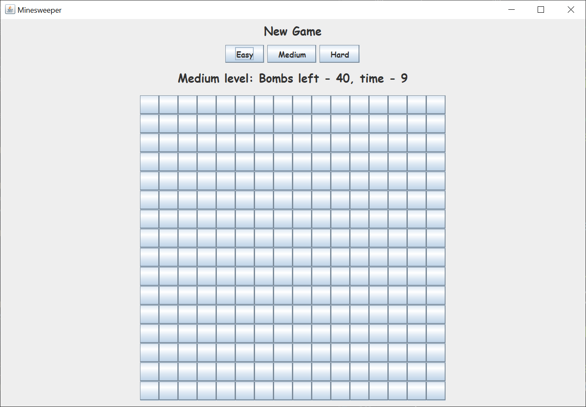

# Minesweeper

## Introduction

I've created yet another version of the Microsoft game Minesweeper.  In this version, there are three levels.

1. The easy level is a 10 x 10 grid, with 10 bombs hidden.
2. The medium level is a 16 X 16 grid, with 40 bombs hidden.
3. The hard level is a 30 x 17 grid, with 99 bombs hidden.

The difference between this Minesweeper game and most other versions, is that **there are no bombs on the perimiter**.  Since you can detect a bomb one space away, it follows that there should be no bombs on the perimiter.  I've always found bombs on the perimiter to be a fatal flaw in most versions of Minesweeper.

The game keeps track of the time you take, and displays your times on a high scores board.

You left-click on a button when you know (suspect) it's not a bomb.  You right-click on a button to flag the button as a bomb.

Here's what the GUI looks like on the easy level.

Here's what the GUI looks like on the medium level.

Here's what the GUI looks like on the hard level.

The reason there's so much empty space on the easy and medium levels is that I wanted to keep the buttons a consistent 30 x 30 pixels.  That way, no matter which level you play, the game feels consistent.  The frame is 934 x 677 pixels.

Here's what the GUI looks like when you're part way through a game (on the easy level).

Here's what the GUI looks like when you've found all the bombs (on the easy level).  This is a different game than the previous image.  I didn't think to snap the previous image until after I'd written most of this document.

Here's what the high score (low time) JDialog looks like (for the easy level)  There are separate high score boards for the easy, medium, and hard levels.

## Explanation

When I create a Java Swing GUI, or most Java applications, I use the [model / view / controller](https://en.wikipedia.org/wiki/Model%E2%80%93view%E2%80%93controller) (MVC) pattern.  This pattern helps me separate my concerns and allows me to focus on one part of the Java application at a time.

If you’re not familiar with Java Swing, Oracle has an excellent tutorial to get you started, [Creating a GUI With JFC/Swing](https://docs.oracle.com/javase/tutorial/uiswing/index.html). Skip the Netbeans section.

In this application, I have five model classes, four view classes, and three controller classes.  There's one additional class to take care of reading and writing the high scores to the local disk drive.

In a Swing GUI, the MVC pattern can be summarized this way:

1.  The view reads information from the model.
2.  The view does not update the model.
3.  The controller updates the model and repaints / revalidates the view.

Usually, there's no "master" controller to rule them all.  Each individual controller takes care of its responsibility.

### Model

The MinesweeperGameType class keeps the information for the current level (easy, medium, or hard) of the game.  This information includes the level name, number of columns, number of rows, panel size and maximum panel size.  This information allows me to adjust the view depending on the game level.

The MinesweeperGameTypeFactory class keeps the game type information for all three game levels, and allows me to switch from one level to another.

The MinesweeperScore class keeps track of the time and manages the high score file.

The MinesweeperGameStatus class keeps track of the bomb locations, the number of buttons marked (bombs found), and which buttons are erased.

The MinesweeperModel class is the main model class, and brings the other model classes together in one place.

### View

The view consists of a JFrame, one main JPanel, and a JDialog to display the high scores.  I created a MinesweeperFont class to hold the font I'm using, which is currently Comic Sans MS.

The main JPanel is divided into a control JPanel and a flow JPanel.  The main JPanel uses a BorderLayout.  The control JPanel contains three subordinate JPanels.  The flow JPanel holds the bombs grid JPanel.

The control JPanel holds three subordinate JPanels; one for the New Game label, one for the game level JButtons, and one for the game status line.  The control JPanel uses a BorderLayout.

The flow JPanel holds a subordinate bombs grid JPanel.  The flow JPanel uses a FLowLayout.  I center the bombs grid JPanel by calculating an appropriate empty border to center the bombs grid JPanel.

The bombs grid JPanel holds the JButton grid.  The bombs grid JPanel uses a GridLayout.  The bombs grid JPanel is built and rebuilt each time one of the game level JButtons in the control JPanel is left-clicked.

The high scores JDialog is displayed after every victory.

### Controller

The MinesweeperTimer class keeps the game clock running.

The GameMouseListener class listens for a left-click on one of the game level buttons in the control panel.

The GridMouseListener class listens for bomb grid button clicks.  A left-click clears the button and all assoicated empty spaces.  A right-click marks the button as a bomb.  The GridMouseListener class is the workhorse of this application.
